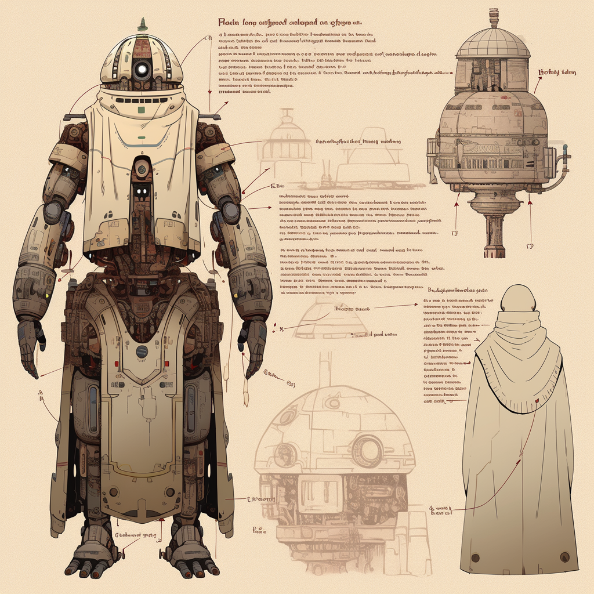

<div align="center">

# Masjid's Droid v2.0.10




[](https://github.com/ccil-kbw/robot/actions/workflows/publish.yml)


</div>

### Table of Contents
- [Introduction](#introduction)
- [Inviting the Bot to Your Server](#inviting-the-bot-to-your-server)
- [Forking and Deploying Your Own Version](#forking-and-deploying-your-own-version)
- [Features](#features)
  - [Iqama Feature](#iqama-feature)
  - [Other Features](#other-features)
  - [Contributions](#contributions)
  - [Future Plans](#future-plans)
- [info](#info)
- [License](#license)

# Introduction

# Introduction

Masjid's Droid is a project born out of the desire to serve the needs of the Masjid Khaled Ben Walid community. However, its vision extends beyond a single community. It is designed to be an open and accessible tool for the Ummah, reaching from East to West.

This bot is not just a tool, but a companion that assists in managing and organizing various tasks within the community. It is a testament to the power of technology in fostering community and facilitating communication.

Whether you're part of the Masjid Khaled Ben Walid community or a member of the Ummah from afar, we welcome you to use, contribute to, and benefit from Masjid's Droid.
# Inviting the Bot to Your Server

To invite the bot to your server, you can use the following link:

```
https://discord.com/oauth2/authorize?client_id=1044631828545405048
```

Replace `YOUR_BOT_CLIENT_ID` with the client ID of your bot. This will allow you to add the bot to any server where you have the 'Manage Server' permission.

# Forking and Deploying Your Own Version

This project is open to everyone and you are free to fork and deploy your own version of the bot. There is no requirement to keep the license or any reference to the original project, although it would be greatly appreciated if you could keep the fork attached to the original. This would allow for interesting contributions back to the upstream repository.

If you choose to fork the project, you can optionally add a link to this repository in your bot's description to spread the shared knowledge. Remember, everyone can own their own copy and continue as they wish. All of this is done for the sake of Allah only.

# Features

## Iqama Feature

The Iqama feature is the main feature of Masjid's Droid. It allows users to get the Iqama times for various masjids. This feature is accessible through the Discord bot and can be used by anyone in the server.

## Other Features

While the Iqama feature is the main feature, there are many other features available in Masjid's Droid. These features are not yet documented, but they are available for use and exploration.

## Contributions

We encourage contributions to Masjid's Droid. If you have an idea for a new feature, feel free to contribute. We welcome all contributions, no matter how small.

## Future Plans

We are planning to develop a frontend using Flutter. This will make it easier for Masjid administrators to control all aspects of their masjids. Stay tuned for updates on this exciting development.

# Info

Documentation about installation and usage are found at [https://ccil-kbw.github.io](https://ccil-kbw.github.io)

# Setup Development Environment

## Prerequisite
- Go 1.22
- [OBS Studio](https://obsproject.com/download)
- [Discord Bot](https://discord.com/developers/docs/quick-start/getting-started)
  - To run and test your Discord Commands in Developer Mode

## Sample Commands
### Verify Go Version

```bash
> go version
go version go1.22.1 windows/amd64
```

### Iquama CLI
```bash
> go run cmd/cli/main.go
+------------+---------+---------+---------+---------+---------+
| DATE       | FAJR    | DHUHUR  | ASR     | MAGHRIB | ISHA    |
+------------+---------+---------+---------+---------+---------+
| 04/16/2024 | 5:15 am | 1:15 pm | 6:15 pm | 7:45 pm | 9:10 pm |
+------------+---------+---------+---------+---------+---------+
```

# License

BSD-3, see LICENSE

